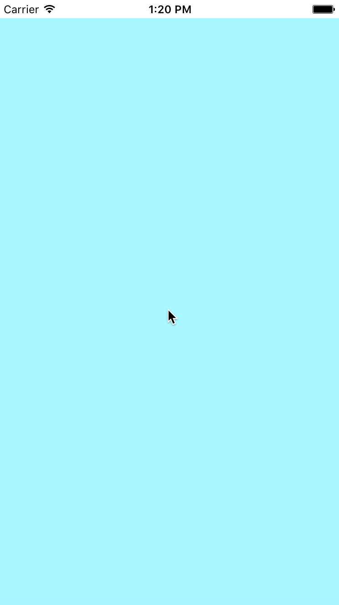

# SimpleSwipe

SimpleSwipe is a straightforward and easy to use UIViewController that offers horizontal swipe navigation between different views, similar to that seen in apps such as Snapchat.

## Implementation
1. Download this repository.

2. Drag and drop SwipeController.swift, and both the .swift and .xib files for SwipeViews A, B, and C into your project.

3. Make a UIViewController of class SwipeController.

4. Add a UIScrollView into the new SwipeController.

5. Delete the outlet `@IBOutlet weak var scrollView: UIScrollView!` from SwipeController.swift

6. Connect your new UIScrollView to SwipeController.swift and name it `scrollView`.

7. Customize the subviews that are swiped between by changing the .swift and .xib files of the corresponding SwipeView.

8. Ta-Da! Your UIScrollView on your SwipeController will now horizontally swipe between your three SwipeViews.

P.S. You can add and delete more SwipeViews by creating more child view controllers in SwipeController.swift, and creating the corresponding .swift and .xib files.